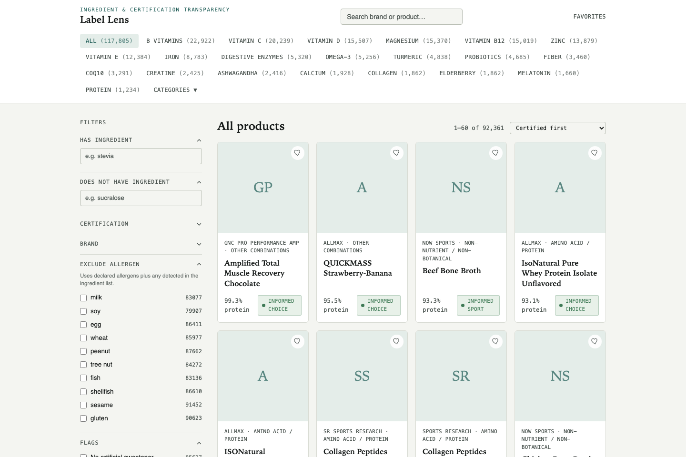
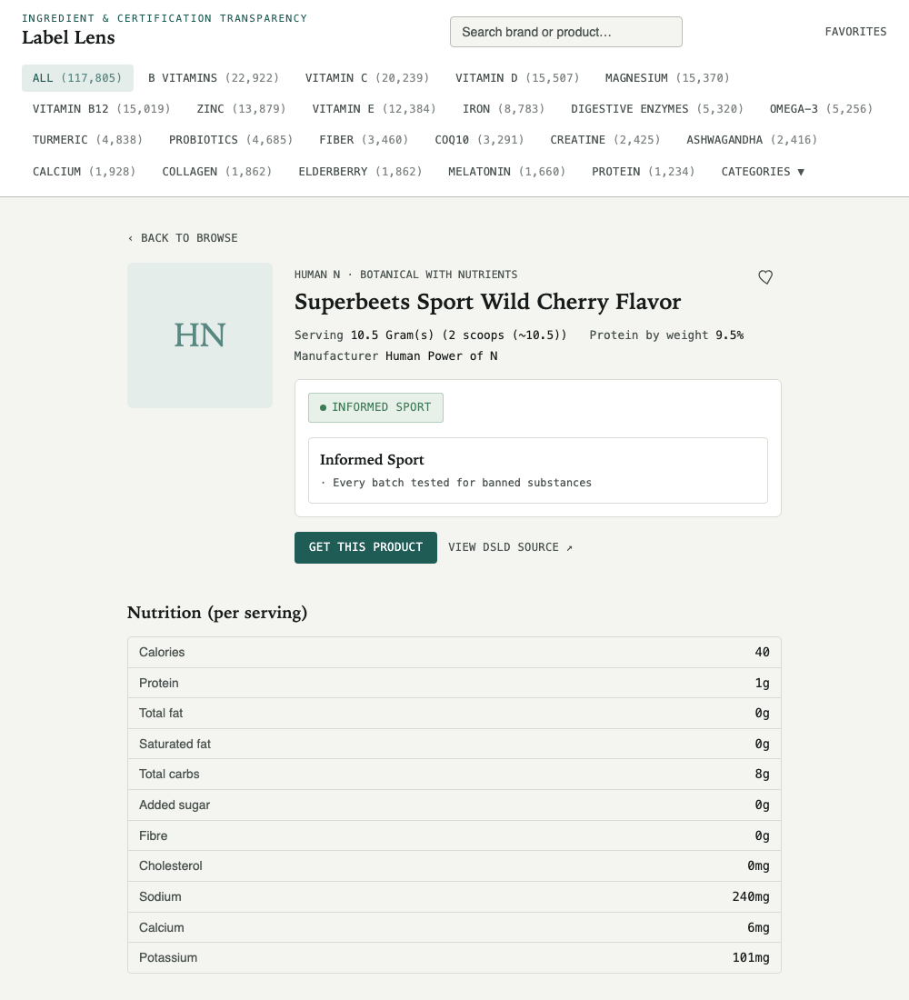

# Label Lens

**A searchable, filterable database of 117,805 dietary supplements — what's actually in them, and which safety claims are independently verified versus just printed on the label.**

🔗 **[Try it live](https://p-bhandari.github.io/ingredient-scanner/)** — no signup, runs entirely in your browser.

[](https://p-bhandari.github.io/ingredient-scanner/)
[](https://github.com/P-bhandari/ingredient-scanner/actions/workflows/deploy-pages.yml)
[](#license)
[](https://dsld.od.nih.gov/)



---

## The problem this solves

Most supplement shoppers assume some regulator checked the bottle before it hit the shelf. **Nobody did.**

In the US, the FDA does not approve dietary supplements for safety or effectiveness before they go on sale. Under DSHEA (1994), a company can often put a supplement on the market without notifying the FDA at all. Every US label carries a legally required disclaimer saying exactly this — *"These statements have not been evaluated by the Food and Drug Administration"* — and almost everyone scrolls past it.

What *does* exist is a patchwork of **independent, opt-in testing** — NSF Certified for Sport, Informed Sport, USP Verified, and others — each testing for different things, at different rigor, and only on the products whose manufacturers paid for it. The rest of the market runs on self-reported claims: "GMP compliant," "third-party tested," "FDA registered facility." Those phrases sound like safety guarantees. Legally, they aren't.

Label Lens draws that line explicitly. Every product gets one of three states:

| State | Meaning |
|---|---|
| 🟢 **Verified** | Carries a real third-party certification (NSF Certified for Sport, Informed Sport, USP Verified, BSCG, or similar) |
| 🟡 **Claim-only** | The label asserts GMP compliance, FDA registration, or "third-party tested" — with no certification backing it |
| ⚪ **Neutral** | No trust claims made either way |

No product is scored, ranked, or rated. The site shows what's verifiable and what isn't, and lets you filter on that distinction yourself.



---

## What's in it

- **117,805 products** — the full [NIH Dietary Supplement Label Database](https://dsld.od.nih.gov/) (DSLD), not a scrape: every label was transcribed by NIH's Office of Dietary Supplements from the actual physical packaging.
- **12 categories**, using DSLD's own classification (vitamins, minerals, botanicals, amino acids/protein, and so on) rather than a guessed taxonomy.
- **6,028 brands**, **77,260 distinct ingredients**.
- **21 curated ingredient shortcuts** (Vitamin D, Magnesium, Omega-3, Probiotics, …) as one-click entry points, matched only against a label's *active* ingredients — never against capsule fillers like magnesium stearate that happen to share a name.
- **Allergen detection** from both the label's declaration and its ingredient list, since a large share of labels declare no allergens at all — including some that list milk or soy by name.
- **Full-text search** across brand, product name, and ingredients; filters for certification, allergens, brand, artificial sweeteners, proprietary blends, and (where derivable) protein density.

## Data source & license

Built entirely on the **[NIH Dietary Supplement Label Database](https://dsld.od.nih.gov/)**, released under **CC0 1.0 — public domain**. No scraping, no unofficial API, no terms-of-service ambiguity. Every product page links back to its original DSLD record.

## How it's built

A static site, deliberately — no backend, no database server, nothing to keep running.

```
labellens/       Python package: DSLD API client, Pydantic schema, ingredient/
                  allergen taxonomy, certification matching
webapp/scripts/   Streams the ~350MB source export into what the site actually ships:
                  a compact browse index, 360 sharded per-product detail files
                  (fetched lazily, one per product view), and precomputed
                  autocomplete/shortcut facets
webapp/           React 19 + TypeScript + Vite + Tailwind, deployed to GitHub Pages
tests/            pytest (Python) + Vitest (webapp)
```

At 117,805 products, the raw data is too large to ship as one bundle, so the browse view loads a single ~60MB index (everything needed to search, filter, and sort) and fetches a product's full detail — full ingredient list, nutrition panel, certification detail — only when you open it.

## Running it locally

**Webapp** — the built data files (`webapp/public/data/`) are already checked into this repo, so this runs immediately:

```bash
cd webapp
npm install
npm run dev
```

**Rebuilding the data** from a fresh DSLD export (only needed if you want to regenerate the catalogue):

```bash
pip install -e ".[full]"
python webapp/scripts/prepare_full_catalogue.py
```

This streams `data/dataset_supplements_full.json` (not included in this repo — see `docs/full-supplement-dataset.md` for how it's produced) into `webapp/public/data/`.

**Tests:**

```bash
pytest                      # Python: schema, taxonomy, allergen detection
cd webapp && npm test        # webapp: filter logic, search, sort
```

## Disclaimer

This is not medical advice. Label Lens surfaces what a product's label says and whether any part of that is independently verified — it does not assess whether a product is safe or suitable for anyone.

## License

Code is [MIT](https://opensource.org/licenses/MIT). Underlying label data is [CC0 1.0](https://dsld.od.nih.gov/) via NIH's Office of Dietary Supplements — attribution: *National Institutes of Health, Office of Dietary Supplements. Dietary Supplement Label Database. https://dsld.od.nih.gov/*
